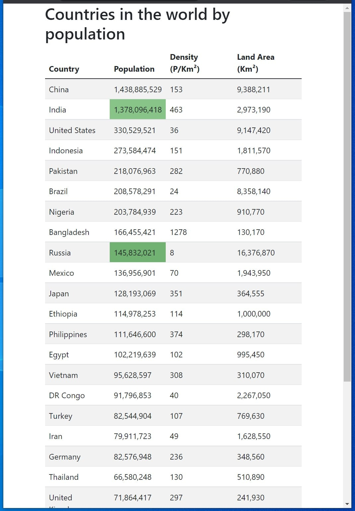

# php-sse-react-redis-example

## Installing

    mkdir php-sse-react-redis-example
    cd php-sse-react-redis-example
    git clone --dept 1 git@github.com:mahmutbayri/php-sse-react-redis-example.git .
    composer install

## Command
    
    // It inserts sample data to your redis server    
    php parseData.php

    // It manipulates data on your redis server and publishes a partial data. You will see the changes when you http://localhost:9800     
    php manipulateData.php

    // It starts the server
    php serve.php

## demo

Navigate this address with your browser

    http://localhost:9800

With curl command

    curl -N http://localhost:9800/demo

## screenshots

